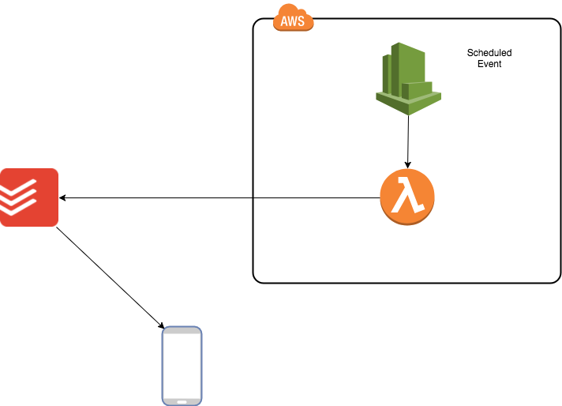

# PlanMYDay

 [](https://travis-ci.org/matteo-hertel/PlanMyDay)
[](https://codeclimate.com/github/matteo-hertel/PlanMyDay/coverage)
[](https://codeclimate.com/github/matteo-hertel/PlanMyDay) 

[Serverless](https://serverless.com/) function to randomly set a ToDoist task deadline to today

## Why?
I don't know about you guys but every time I find an interesting article, a course/workshop I want to follow or a new library I want to check I save the link somewhere with the hope on reading it later on, just saving the link didn't work, so I tried creating a task on [Todoist](https://todoist.com) and setting some deadline that I'm never able to meet and I find myself with 50 tasks to do, definitely not ok, so I ended up creating this

## So what's this all about then?
The idea is simple: every day a serverless function runs, picks randomly a task from a predefined set of projects and sets the deadline to today, so every single day I have only one thing to do on the continuous learning/experimenting side of life, definitely something I can manage!

## Architecture 
Here's a diagram of the architecture, it's definitely not needed, but it looks cool



## Can I use it?
Sure you can, although I don't know how beneficial this could be for anybody but me, it's for my specific use case only, but if you like it then go for it!

## Set up
the set up is super easy, you just need a `token` for your todoist account, once you have that:

1. Get a list of projects from your todoist, I got mine from `https://beta.todoist.com/API/v8/projects?token=your_token`
2. grab the IDs of the projects you want
3. create a `environment.yml` and put in
```
TODOIST_PROJECTS: 'space separated list of projects id keep the quotes'
TODOIST_API_TOKEN: your_token
S3_DEPLOY_BUCKET: your serverless bucket
```
4. issue `serverless deploy`
5. Bob's your uncle, you're done! 

## Misc
There are a lot of improvements that can be done, I just had this from idea to deployed in like 5 hours, and fits my need perfectly, if you like it or you want to improve it PRs are welcome or just fork it and have your own version!